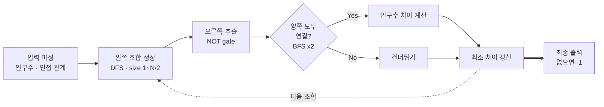

> [백준 17471 - 게리맨더링](https://www.acmicpc.net/problem/17471)
{: .prompt-info }


_문제 예시: 구역 간 인접 관계와 인구수_

## 요약

BFS, DFS, NOT gate, 완전탐색이 압축되어 있는 알고리즘 문제다. 그래프 관련 이론과 구현이 필수 요소이며, 추가적으로 문제를 어떻게 분할-정복 (Divide and Conquer) 하는지가 중요하다.

## 문제풀이

- 구역 2개를 왼쪽 (l) vs 오른쪽 (r)으로 나눴다

### 1. 시각화


_5단계 모듈 파이프라인_

### 2. 자료구조 및 입력 받기

삼성 유형 문제답게 효율 및 최적화보다는 완전탐색으로 구현하여 프로그래밍으로 문제를 풀 수 있는지의 여부가 더 중요하다. 따라서 자료구조는 그래프를 순회할 수 있는 형태이기만 하면 문제 푸는 데 걸림돌이 되지 않는다.

```python
import sys
from math import inf
from collections import defaultdict, deque
input = sys.stdin.readline

NO_REGION = int(input().strip())
ARR_POPULATION = [0] + list(map(int, input().strip().split(' ')))
ADJ_DICT = defaultdict(list)
for idx in range(1, NO_REGION + 1):
    ADJ_DICT[idx] = list(map(int, input().strip().split(' ')))[1:]
```
{: file="입력 파싱 및 자료구조 초기화" }

### 3. DFS 활용하여 왼쪽 구역 조합 생성

```python
# finding all combinations
def dfs(start, arr_curr, arr_out, size_curr):
    if len(arr_curr) == size_curr:
        arr_out.append(arr_curr.copy())
        return arr_out

    for idx in range(start, NO_REGION + 1):
        arr_curr.append(idx)
        arr_out = dfs(idx + 1, arr_curr, arr_out, size_curr)
        arr_curr.pop()

    return arr_out

l_region_cluster = []
for size in range(1, NO_REGION//2 + 1):
    l_region_cluster.extend(dfs(1, [], [], size))
```
{: file="왼쪽 구역 조합 생성 (DFS)" }

- 여기서 나름 최적화한 부분이라면, 주어진 지역의 반 (1/2)을 넘어가는 시점부터 같은 조합이 반복되므로 `NO_REGION//2 + 1`을 활용하였다.

### 4. NOT gate 활용하여 오른쪽 구역 추출

```python
# NOT gate (if left is 0, then right must be 1)
def get_r_region_cluster(l_region_cluster):
    r_region_cluster = []

    for l_region in l_region_cluster:
        visited = [True] + [False for _ in range(NO_REGION)]
        r_region = []

        for region in l_region:
            visited[region] = True

        for idx in range(NO_REGION + 1):
            if not visited[idx]:
                r_region.append(idx)

        r_region_cluster.append(r_region)

    return r_region_cluster

r_region_cluster = get_r_region_cluster(l_region_cluster)
```
{: file="오른쪽 구역 추출 (NOT gate)" }

### 5. BFS 활용하여 양쪽 구역 연결요소 확인

```python
# checking for connectivity
def bfs(cluster):
    visited = [True] + [False for _ in range(NO_REGION)]
    visited[cluster[0]] = True
    q = deque([cluster[0]])

    while q:
        curr_region = q.popleft()

        for neighbor_region in ADJ_DICT[curr_region]:
            if not visited[neighbor_region] and neighbor_region in cluster:
                q.append(neighbor_region)
                visited[neighbor_region] = True

    for region in cluster:
        if not visited[region]:
            return False

    return True
```
{: file="연결요소 확인 (BFS)" }

### 6. 구현한 모듈 종합

조합 → 연결요소까지 다 확인되어 인구수 비교가 가능한 상태가 되었으니, 이제 종합하여 인구수 최소 차이만 남기면 된다.

```python
def get_population_difference(l_region, r_region):
    l_population, r_population = 0, 0

    for l in l_region:
        l_population += ARR_POPULATION[l]

    for r in r_region:
        r_population += ARR_POPULATION[r]

    return abs(l_population - r_population)

# checking connectivity and if no issue, compute population difference
global_min = inf
for idx in range(len(l_region_cluster)):
    if bfs(l_region_cluster[idx]) and bfs(r_region_cluster[idx]):
        global_min = min(global_min, get_population_difference(l_region_cluster[idx], r_region_cluster[idx]))

# output format
if global_min == inf:
    print(-1)
else:
    print(global_min)
```
{: file="모듈 종합 및 인구수 최소 차이 계산" }

이 문제의 의도와 압축돼 있는 정보를 이해하는 순간, 내가 제일 좋아하는 알고리즘 문제 탑3 안에 드는 것 같다. 게리맨더링 이후 풀어본 다른 삼성 기출 유형 문제 (낚시왕, 구슬탈출, 테트로미노 등등)도 너무 재미있었다.

## Food for Thought

모듈러하게 문제를 해결할 경우 모든 경우의 수를 따로 저장하고 풀이를 진행하는데, 공간적으로 비효율적인 면이 부각된다.

- DFS에서 각 Permutation을 만드는 경로의 `return` 시점마다 그 순간 왼쪽/오른쪽을 확인하고 "연결 요소 확인" → (연결 요소가 OK인 경우) 인구수 차이를 계산하면, 공간을 재사용할 수 있어 효율적이다.
- DFS에서 left list 대신 left visited (최대 10이므로 bitmasking 활용 가능)를 유지하면, 별도의 list를 순회하지 않고도 left/right (true/false 여부)를 바로 판별할 수 있다. 즉, 2 integer (~16 x 2 byte) vs 2 boolean list (~a x 8 x 10 x 2 byte) 만큼 공간 차이가 난다.
