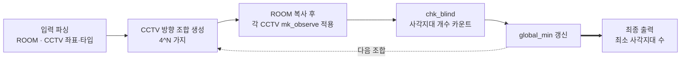

> [백준 15683 - 감시](https://www.acmicpc.net/problem/15683)
{: .prompt-info }


_문제 예시: 사무실과 CCTV 배치_

## 요약

구현 · 시뮬레이션 · 완전탐색이 모두 들어가 있는 코딩 문제다. 중복순열 (Permutations with Repetition)과 행렬 순회 구현이 필수 요소다. 모든 경우의 수를 미리 저장하지 않고 DFS로 만들어 가며 시뮬레이션하면, 공통 prefix 계산이 재사용되면서 메모리 할당 (Memory Allocation)도 줄어 소요 시간이 무려 3배까지 차이가 나는 문제다.

## 문제풀이

### 1. 시각화


_완전탐색 + 시뮬레이션 파이프라인_

### 2. 자료구조

주어진 자료에서 CCTV (감시카메라)의 좌표와 타입을 `(row, col, cctv_type)` tuple로 묶어 배열에 저장했다.

```python
def get_cctv_coord():
    arr_cctv = []
    surveillance_space_ctr = 0

    for row in range(HEIGHT):
        for col in range(WIDTH):
            if 0 < ROOM[row][col] < 6:
                arr_cctv.append((row, col, ROOM[row][col]))

    return arr_cctv
```
{: file="CCTV 좌표 및 타입 추출" }

### 3. 방문기록

```python
def mk_observe(room, cctv_coord, d):
    row, col = cctv_coord

    drow = [-1, 0, 1, 0]
    dcol = [0, 1, 0, -1]

    while True:
        nrow = row + drow[d]
        ncol = col + dcol[d]

        if 0 <= nrow < HEIGHT and 0 <= ncol < WIDTH:
            if room[nrow][ncol] == 6:
                return
            else:
                room[nrow][ncol] = -1  # later will only count values of 0, so wtv works
        else:
            return

        row = nrow
        col = ncol
```
{: file="방문 기록" }

한 방향만 바라보는 함수를 작성했다. 카메라 5가지 모두 이 함수를 방향별로 필요한 횟수만큼 호출하면 된다.

### 4. 완전탐색 + 시뮬레이션

두 가지 방법으로 구현이 가능했다.

#### A. 모듈형 — 모든 경우의 수를 먼저 배열에 저장하고 시뮬레이션 돌리기

```python
from itertools import product

arr_cctv = get_cctv_coord()
arr_combo = list(product([0, 1, 2, 3], repeat=len(arr_cctv)))

for combo in arr_combo:
    # shallow copy: new instance must be generated since Python uses references
    curr_room = [row[:] for row in ROOM]

    for idx in range(len(arr_cctv)):
        cctv_row, cctv_col, cctv_type = arr_cctv[idx]
        cctv_d = combo[idx]

        if cctv_type == 1:
            mk_observe(curr_room, (cctv_row, cctv_col), cctv_d)
        elif cctv_type == 2:
            mk_observe(curr_room, (cctv_row, cctv_col), cctv_d)
            mk_observe(curr_room, (cctv_row, cctv_col), (cctv_d+2)%4)
        elif cctv_type == 3:
            mk_observe(curr_room, (cctv_row, cctv_col), cctv_d)
            mk_observe(curr_room, (cctv_row, cctv_col), (cctv_d+1)%4)
        elif cctv_type == 4:
            mk_observe(curr_room, (cctv_row, cctv_col), cctv_d)
            mk_observe(curr_room, (cctv_row, cctv_col), (cctv_d+1)%4)
            mk_observe(curr_room, (cctv_row, cctv_col), (cctv_d+3)%4)
        else:
            mk_observe(curr_room, (cctv_row, cctv_col), cctv_d)
            mk_observe(curr_room, (cctv_row, cctv_col), (cctv_d+1)%4)
            mk_observe(curr_room, (cctv_row, cctv_col), (cctv_d+2)%4)
            mk_observe(curr_room, (cctv_row, cctv_col), (cctv_d+3)%4)

    global_min = min(global_min, chk_blind(curr_room))
```
{: file="A. 모듈형 — itertools.product" }

#### B. 통합형 — 경우의 수를 만들면서 시뮬레이션 돌리기

```python
def dfs_room(arr_cctv, curr_cctv_idx, room, global_min):
    if curr_cctv_idx == len(arr_cctv):
        return min(global_min, chk_blind(room))

    cctv_row, cctv_col, cctv_type = arr_cctv[curr_cctv_idx]

    for cctv_d in range(4):
        curr_room = [row[:] for row in ROOM]

        if cctv_type == 1:
            mk_observe(curr_room, (cctv_row, cctv_col), cctv_d)
        elif cctv_type == 2:
            mk_observe(curr_room, (cctv_row, cctv_col), cctv_d)
            mk_observe(curr_room, (cctv_row, cctv_col), (cctv_d+2)%4)
        elif cctv_type == 3:
            mk_observe(curr_room, (cctv_row, cctv_col), cctv_d)
            mk_observe(curr_room, (cctv_row, cctv_col), (cctv_d+1)%4)
        elif cctv_type == 4:
            mk_observe(curr_room, (cctv_row, cctv_col), cctv_d)
            mk_observe(curr_room, (cctv_row, cctv_col), (cctv_d+1)%4)
            mk_observe(curr_room, (cctv_row, cctv_col), (cctv_d+3)%4)
        else:
            mk_observe(curr_room, (cctv_row, cctv_col), cctv_d)
            mk_observe(curr_room, (cctv_row, cctv_col), (cctv_d+1)%4)
            mk_observe(curr_room, (cctv_row, cctv_col), (cctv_d+2)%4)
            mk_observe(curr_room, (cctv_row, cctv_col), (cctv_d+3)%4)

        global_min = dfs_room(arr_cctv, curr_cctv_idx + 1, curr_room, global_min)

    return global_min
```
{: file="B. 통합형 — DFS" }

## 결과 및 분석


_BOJ 제출 결과 비교_

{: .right .w-25 }

- A. 모듈형: 1416ms
- B. 통합형: 420ms

둘 다 완전탐색이므로 시간 복잡도는 동일하다. 그런데 메모리 사용량 (39388KB vs 33240KB)도 실행 시간 (1416ms vs 420ms)도 같이 차이가 난다. 우선 메모리 차이의 원인을 좁히기 위해 `tracemalloc`을 활용해봤다.

```python
import tracemalloc

tracemalloc.start()

###############
# source code #
###############

current, peak = tracemalloc.get_traced_memory()
tracemalloc.stop()
print(f"Current memory usage: {current / 10**6}MB; Peak: {peak / 10**6}MB")
```
{: file="메모리 측정 (tracemalloc)" }

```text
# A. 모듈형 입출력
6 6
1 0 0 0 0 0
0 1 0 0 0 0
0 0 1 5 0 0
0 0 5 1 0 0
0 0 0 0 1 0
0 0 0 0 0 1
2
Current memory usage: 7.379352MB; Peak: 7.3798MB

# B. 통합형 입출력
6 6
1 0 0 0 0 0
0 1 0 0 0 0
0 0 1 5 0 0
0 0 5 1 0 0
0 0 0 0 1 0
0 0 0 0 0 1
2
Current memory usage: 0.002832MB; Peak: 0.006368MB
```
{: file="실행 결과 비교" }

`tracemalloc` 실측에서도 7.38MB vs 0.006MB로 1000배 이상 차이가 났다. BOJ 측정값의 약 6MB 차이 거의 전부가 A의 `arr_combo` 사전 할당에서 비롯된다고 볼 수 있다.

여기서부터가 핵심인데, 두 구현체의 차이는 사실 **서로 독립적인 두 메커니즘**이 한꺼번에 작동한 결과다. DFS 하나의 구현 결정으로 두 효과가 동시에 발생하다 보니 마치 하나의 "재사용" 효과처럼 보이지만, 풀어보면 다음과 같다.

### 1. 재사용 (Prefix Sharing) — 시간 차이의 주 원인

**총 3가지 combo = `[(1,1,1), (1,1,2), (1,1,3)]`이 있다고 가정하면:**

- **A (모듈형)** → 각 combo마다 처음부터 끝까지 따로 계산하므로 **총 9번**의 CCTV 적용이 들어간다.
- **B (통합형)** → 앞의 `[1, 1]`은 DFS로 공유하여 한 번씩만 계산하고, 마지막 element `[1, 2, 3]`만 추가로 계산하면 되므로 **총 5번**의 CCTV 적용이 들어간다.

CCTV 개수 N으로 일반화하면 두 구현체의 `mk_observe` 호출량은 다음과 같다.

- **A**: 매 leaf마다 N개의 CCTV를 처음부터 다시 적용 → 약 $4^N \cdot N$회
- **B**: DFS 트리의 각 node에서 현재 level CCTV 하나만 적용 → 약 $\sum_{i=1}^{N} 4^i \approx 4^N \cdot 4/3$회

즉 B는 A보다 약 $3N/4$배 적은 `mk_observe` 호출이 들어간다. 문제 최댓값 N=8이면 **약 6배 차이**다. 이게 시간 차이의 가장 큰 부분을 설명한다.

> 한 가지 미묘한 점: B가 모든 작업을 적게 하는 건 아니다. 사실 `curr_room` 복사는 B가 더 많이 한다 (DFS 트리 노드 수 $\approx 4^N \cdot 4/3$ vs A의 leaf 수 $4^N$). 다만 복사 비용 ($O(W \cdot H)$ memcpy)이 ray-trace 비용 (CCTV 타입에 따라 1~4번의 $O(\max(W,H))$)보다 훨씬 싸기 때문에, 복사를 더 하면서도 전체적으로 빠르다.
{: .prompt-info }

### 2. 메모리 할당 (Memory Allocation) — 메모리 차이의 전부 + 시간 차이의 부수 요인

A의 `arr_combo = list(product([0,1,2,3], repeat=N))`은 모든 경우의 수를 **명시적으로** 메모리에 펼친다. N=8일 때 $4^8 = 65{,}536$개 tuple × CPython tuple 헤더·int 참조 오버헤드 (~120 byte) ≈ **약 7-8MB**가 한 번에 할당된다. 이게 BOJ 메모리 차이의 거의 전부다.

반면 B는 사전 할당이 없고, 살아 있는 메모리는 (a) 재귀 스택 깊이 N + (b) 현재 `curr_room` 하나뿐이다. 그래서 `tracemalloc` peak가 6KB 수준까지 떨어진다.

메모리 차이는 시간에도 부수적으로 영향을 미친다.

- **할당 오버헤드**: 7-8MB 객체 할당은 Python allocator 호출과 필요 시 `mmap` / `brk` system call을 유발한다.
- **Cache locality**: A는 큰 `arr_combo`를 순회하면서 캐시 미스가 잦지만, B의 working set은 작아 L1/L2 캐시에 잘 맞는다.

이 두 효과가 시간 차이의 나머지 30~40% 정도를 차지하는 것으로 추정된다.

---

정리하면 DFS는 한 번의 구현 결정으로 두 가지를 동시에 가능하게 한다 — **search space 스트리밍** (메모리 절약)과 **부모 state 상속** (계산 절약). 단일 효과처럼 보이지만 사실은 독립적인 두 메커니즘이고, 합쳐져서 3.4배 속도 차이를 만든다.
