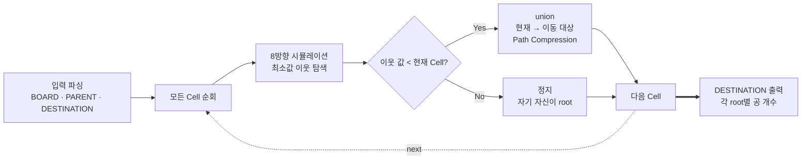

> [백준 16957 - 체스판 위의 공](https://www.acmicpc.net/problem/16957)
{: .prompt-info }


_문제 예시: 체스판 위의 공_

## 요약

문제 풀이는 행렬 순회와 완전탐색만으로도 가능하다. 하지만 같은 곳을 다시 순회해도 결과가 동일하기 때문에, 매번 처음부터 끝까지 재탐색하면 시간 초과를 받게 된다. 따라서 중복 순회를 피하게 해주는 Union-Find를 활용해야 TLE (Time Limit Exceeded)를 면할 수 있는 문제다.

## 문제풀이

### 1. 시각화


_Union-Find 기반 시뮬레이션 흐름_

### 2. 자료구조

기본적인 Union-Find에 필요한 Parent 1D 배열을 선언하고, Union by Size를 이 문제에 맞게 살짝 변형해서 쓰기 위해 Destination 1D 배열도 추가로 선언했다.

```python
HEIGHT, WIDTH = map(int, input().strip().split(' '))
BOARD = [list(map(int, input().strip().split(' '))) for _ in range(HEIGHT)]
PARENT = [idx for idx in range(WIDTH * HEIGHT)]
DESTINATION = [1 for _ in range(WIDTH * HEIGHT)]
```
{: file="입력 파싱 및 자료구조 초기화" }

### 3. Union-Find 활용

기본적으로 주어지는 자료가 2D 배열이므로 1D 배열 index 변환 함수를 만들고, Union by Size는 이 문제에 맞게 수정하여 사용한다. 현재 Cell에서 공을 옮길 수 있다고 판단되면, 그 Cell의 공 전체를 옮길 대상 Cell로 합친다.

```python
def coord_to_idx(row, col):
    return row * WIDTH + col

def find(idx):
    if PARENT[idx] != idx:
        PARENT[idx] = find(PARENT[idx])
    return PARENT[idx]

def union(idx1, idx2):
    r1 = find(idx1)
    r2 = find(idx2)

    if r1 != r2:
        PARENT[r1] = r2
        DESTINATION[r2] += DESTINATION[r1]
        DESTINATION[r1] = 0
```
{: file="Union-Find (Union by Size 변형)" }

### 4. 시뮬레이션 구현

```python
def simulate(row, col):
    drow = [-1,-1,0,1,1,1,0,-1]
    dcol = [0,1,1,1,0,-1,-1,-1]

    cmp_row, cmp_col = row, col

    for d in range(8):
        nrow = row + drow[d]
        ncol = col + dcol[d]

        if 0 <= nrow < HEIGHT and 0 <= ncol < WIDTH:
            if BOARD[cmp_row][cmp_col] > BOARD[nrow][ncol]:
                cmp_row, cmp_col = nrow, ncol

    if BOARD[cmp_row][cmp_col] != BOARD[row][col]:
        union(coord_to_idx(row, col), coord_to_idx(cmp_row, cmp_col))
```
{: file="8방향 시뮬레이션" }

## 결과

Naive BFS (완전탐색) 대신 Union-Find를 활용하면 시간과 공간 복잡도는 다음과 같이 변경된다.

- 공간 복잡도: $O(W \cdot H)$ → $O(2 \cdot W \cdot H)$ (linear → linear, 소폭 증가)
- 시간 복잡도: $O((W \cdot H)^2)$ → $O(W \cdot H)$ (polynomial → linear, 대폭 감소)
