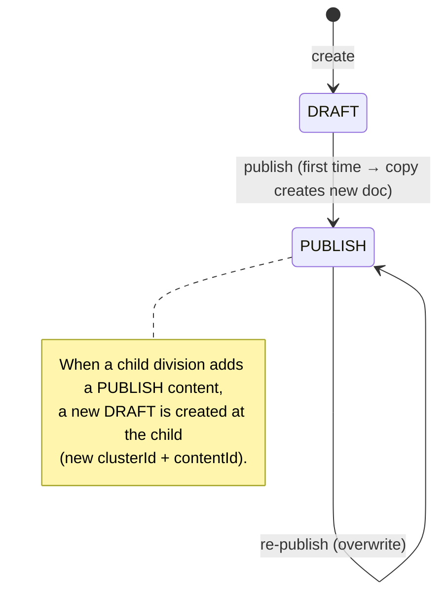

## Summary

- **KIA Users** → hierarchical division tree (5 levels, parent-linked)
- **Content** → parent document with 1:1 typed children
- **Editing & visibility** → draft/publish model

The KIA user hierarchy is given by the client side — it mirrors KIA's **DDMS** (Dealer Distributor Management System). The content management structure was designed through back-and-forth among client, designer, and developer.

## KIA Users → DCE Divisions

KIA's DDMS defines 5 user types:

HQ
: Headquarters — the brand itself (KIA)

RHQ
: Regional Headquarters — oversees a multi-country region

NSC
: National Sales Company — KIA's per-country subsidiary

Distributor
: Imports and wholesales within a country

Dealer
: Customer-facing retail outlet

At its most basic, the schema looks like this:

_Division hierarchy: HQ → RHQ → NSC → Distributor → Dealer, with sample `divisionId`s_

Each division stores both `divisionId` and `parentDivisionId`, so the tree is traversable in both directions — needed for dashboard data aggregation, where roll-ups require walking up the parent chain.

_Each level's fields: `divisionId` + `parentDivisionId` form the parent-pointer chain_

## Content Model

### Schema

In the `idcx-admin` client UI, a content looks like:

{: .shadow .rounded-10 }
_DCE admin UI: one Content (e.g. `CARNIVAL`) with General Settings and a sidebar of its child content types_

A Content is the parent document; the sidebar lists its children:

- Docent Guide
- Story Contents
- Docent Tour — Exterior / Interior / Technology
- Promotion Video
- Spec Summary
- Dealer Specials
- QR Templates

Each child is its own document, linked back to the parent via `contentId`. The relationship is strict 1:1 — each Content has exactly one Guide, one Story, etc.

_Abstract schema: the parent `Content` (with `contentId`, `clusterId`, `status`) and its 1:1 children that all reference back via `contentId`_

### Draft/Publish Lifecycle

#### Rules

- Only `DRAFT` status documents are directly editable.
- `PUBLISH` status documents:
  - are created by **copy** on first publish (a new PUBLISH doc gets a new `contentId`) or **overwrite** on re-publish (the existing PUBLISH doc is updated in place).
  - are visible only to **child** divisions — e.g. when a DISTRIBUTOR publishes a content, its DEALERs can see and add that content (the DISTRIBUTOR itself keeps editing the DRAFT).

The full state machine:

#### In Action

**Init.** DISTRIBUTOR `div_11` has two DRAFT contents (in clusters `clu_1` and `clu_2`). DEALER `div_111` has nothing — there's no PUBLISH content visible to it yet.

_Init: DISTRIBUTOR has two DRAFT clusters; DEALER has no visible content_

**On Publish.** DISTRIBUTOR `div_11` publishes the content in `clu_1`. A new `con_2` PUBLISH document is created alongside the existing `con_1` DRAFT (1 DRAFT → 0..1 PUBLISH). The DEALER can now see `con_2` and add it.

_On publish: a new PUBLISH document is created in the same cluster; visible to DEALERs to add or update_

**On Add.** DEALER `div_111` adds the published content. A new `clusterId` (`clu_11`) and `contentId` (`con_11`) are generated for the DEALER's copy, and the new content starts in DRAFT status — the DEALER can edit it before publishing. (In this case, no further levels exist below DEALER, so the cycle terminates here.)

_On add: DEALER creates a new cluster + content in DRAFT, copied from the parent's PUBLISH content_

## Takeaways

Three patterns are in play here, each chosen to fit a specific constraint:

- **Hierarchical tree with stored parent pointers** — explicit `parentDivisionId` makes upward roll-up (dashboard aggregation) cheap. An adjacency-list pattern, not nested-set or materialized-path; chosen because the tree is shallow (5 levels) and reads dominate writes.
- **Parent-children content with 1:1 typed children** — keeps each child's schema clean and independently evolvable, while the parent tracks aggregate state (`status`, `clusterId`). The UI's tabbed sidebar maps directly onto the children.
- **Draft/publish with copy semantics** — publishing creates a separate PUBLISH document rather than mutating the DRAFT in place. The editor keeps a working draft while subordinates see a stable snapshot. The cycle repeats per level: a parent's PUBLISH becomes the next level's DRAFT (under a new cluster/content id) once added.
