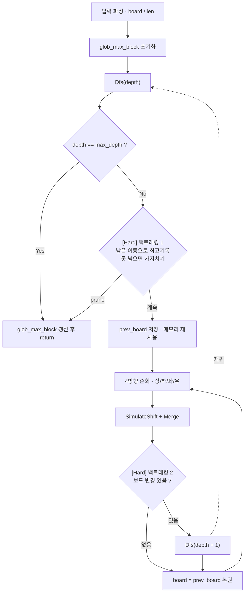

> **Easy** — [백준 12100 - 2048 (Easy)](https://www.acmicpc.net/problem/12100)
>
> **Hard** — [백준 12094 - 2048 (Hard)](https://www.acmicpc.net/problem/12094)
{: .prompt-info }


_문제 예시: 2048_

## 요약

이 문제는 Easy와 Hard로 난이도가 나뉜다. Easy는 크게 두 가지를 할 줄 알아야 된다: 구현과 완전탐색. Easy의 경우 현재 보드판 상태에서 총 4가지 선택 (상,하,좌,우)이 가능하며 총 5번 이동이므로 최대 $4^5$ 가지 상태만 확인하면 되어 충분히 가능하다. Hard의 경우 총 10번 이동이므로 최대 $4^{10}$. 관리해야 되는 변수가 `int` 같은 몇 바이트면 충분히 AC (Accepted) 받을 수 있는 조건이지만, 보드 복사 (vector 복사) 및 칸 계산 같은 추가적인 오버헤드가 추가되므로 최적화를 해야만 한다. DFS 기반으로 문제를 풀이한 경우 백트래킹과 메모리 최적화를 할 수 있는 이점을 살려야 한다.

> 이 문제는 TLE (Time Limit Exceeded)와 MLE (Memory Limit Exceeded)가 발생하기 쉬운 편이라, interpreter 대신 compiler를 쓰고 재귀를 효율적으로 처리하는 C++를 활용하였다.
{: .prompt-tip }

## 문제풀이

### 1. 시각화


_DFS 완전탐색 + 백트래킹 흐름 (점선 = 재귀 호출, [Hard] 표시는 Hard 전용 가지치기)_

### 2. 자료구조 및 입력받기

```cpp
int len;
int glob_max_block = 0;
vector<vector<int>> board;

cin >> len;
board.resize(len, vector<int>(len));
for (int row = 0; row < len; row++) {
    for (int col = 0; col < len; col++) {
        cin >> board[row][col];
    }
}

// 초기 보드 최대 칸값 추출
glob_max_block = max(glob_max_block, GetMaxBlock());
```
{: file="입력 파싱 및 자료구조 초기화" }

### 3. 재사용 함수

```cpp
int GetMaxBlock() {
    int max_block = 0;

    for (int row = 0; row < len; row++) {
        for (int col = 0; col < len; col++) {
            max_block = max(max_block, board[row][col]);
        }
    }

    return max_block;
}
```
{: file="현재 보드 상태의 최대 칸값 추출" }

```cpp
vector<int> Merge(vector<int> &line) {
    vector<int> merged;
    
    for (int i = 0; i < line.size(); i++) {
        if (i + 1 < line.size() && line[i] == line[i+1]) {
            merged.push_back(line[i] * 2);
            i++; // 다음칸 병합에 활용했음으로 다다음칸으로 인덱스 이동
        } else {
            merged.push_back(line[i]);
        }
    }

    return merged;
}
```
{: file="줄(행/열) 병합" }

### 4. 시뮬레이션

```cpp
void SimulateShiftUp() {
    for (int col = 0; col < len; col++) {
        vector<int> line;

        /*
         * 현재 줄(행/열)의 칸값 0 아닌 칸 큐에 삽입 후 칸 0으로 셋팅
         * (예시)
         * 작업 전 
         * - 줄 = []
         * - 열 = [2,2,4,0]
         * 작업 후
         * - 줄 = [2,2,4]
         * - 열 = [0,0,0,0]
         */
        for (int row = 0; row < len; row++) {
            if (board[row][col] == 0)
                continue;
            line.push_back(board[row][col]);
            board[row][col] = 0;
        }

        // 줄 병합
        vector<int> merged = Merge(line);

        // 병합된 줄 보드 적용
        for (int i = 0; i < merged.size(); i++) {
            board[i][col] = merged[i];
        }
    }
}
```
{: file="\"상\" 이동 시뮬레이션" }

> 하·좌·우 생략: 행/열 구분, 시작 인덱스, 인덱스 증가/감소를 알맞게 변형하면 된다.
{: .prompt-info }

### 5. [Easy] Naive 완전탐색

```cpp
void Dfs(int depth) {
    if (depth == 5) {
        glob_max_block = max(glob_max_block, GetMaxBlock());
        return;
    }

    for (int d = 0; d < 4; d++) {
        // [Easy] 매 분기점마다 보드 복사 (Hard의 메모리 최적화 미적용)
        vector<vector<int>> prev_board = board;

        if (d == 0) {
            SimulateShiftUp();
        } else if (d == 1) {
            SimulateShiftRight();
        } else if (d == 2) {
            SimulateShiftDown();
        } else {
            SimulateShiftLeft();
        }

        Dfs(depth + 1);
        
        board = prev_board;
    }
}
```
{: file="[Easy] Naive 완전탐색" }

### 6. [Hard] 백트래킹 및 메모리 최적화

```cpp
void Dfs(int depth) {
    if (depth == 10) {
        glob_max_block = max(glob_max_block, GetMaxBlock());
        return;
    }

    /*
     * [Hard 전용] 백트래킹 1
     * 현재 탐색된 최대 칸 기준, 남은 이동 횟수로 도달 못하는 경우 백트랙
     */
    if (GetMaxBlock() * (1 << (10 - depth)) <= glob_max_block)
        return;

    /*
     * [Hard 전용] 메모리 최적화
     * 각 분기점 4개 생성 대신 1개 재사용
     */
    vector<vector<int>> prev_board = board;

    for (int d = 0; d < 4; d++) {
        if (d == 0) {
            SimulateShiftUp();
        } else if (d == 1) {
            SimulateShiftRight();
        } else if (d == 2) {
            SimulateShiftDown();
        } else {
            SimulateShiftLeft();
        }

        /*
         * [Hard 전용] 백트래킹 2
         * 보드 변경이 없는 경우 백트랙
         */
        if (board != prev_board) 
            Dfs(depth + 1);
        
        board = prev_board;
    }
}
```
{: file="[Hard] 백트래킹 + 메모리 최적화" }

## Food for Thought

시간 복잡도와 공간 복잡도는 big-O 기준으로 보면 최대 횟수/깊이와 동일하다.

- 시간 복잡도 = $O(4^{max\ depth} \times n^2)$
- 공간 복잡도 = $O(max \ depth \times n^2)$

Hard 문제는 DFS의 성질을 파악하고 이점을 살려서 AC 받는 문제다.

> Easy 문제풀이때 DFS 성질의 이점을 제대로 활용하지 않다 보니 메모리 최적화가 필요했던 것이다. DFS 성질을 잘 이해하는 사람이라면 Easy에서도 보드 재사용을 했을 것이고, 백트래킹만 신경 썼으면 AC를 받을 수 있었을 것이다.
{: .prompt-tip }

1. **백트래킹**: 주어진 상황에서 더 이상 탐색해도 무의미한 분기점 차단
2. **메모리 최적화**: 재귀/스택을 되감는 과정에서 현재와 이전 값을 가지고 있을 수 있다는 이점 활용

> 추가적으로 흥미로운 점은, 같은 메모리 부분을 재활용함으로써 캐시 히트율도 올라간다는 것이다.
{: .prompt-tip }
